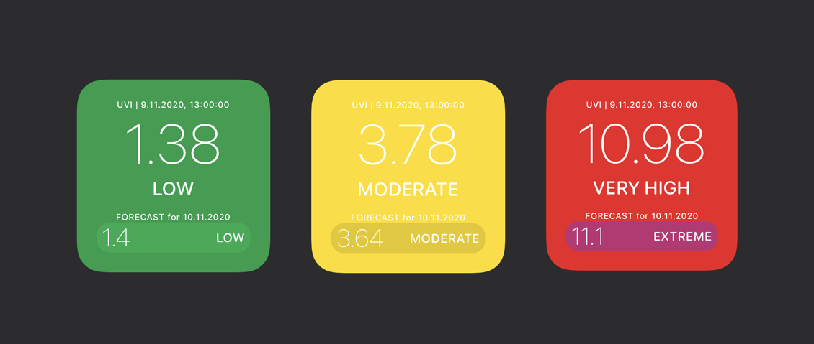

# Scriptable-UV-Index

## This is a widget for the [Scriptable App](https://scriptable.app/) by Simon Støvring.

# Features

- Shows the Ultraviolet Index at your current location.
- Gives a forecast of the UV-Index for the next day.
- Color-Indication of UV-Index based on the standard scale.

# How to Use

1. Sign up for a account on [Openweathermap.com](https://openweathermap.org/appid). Its free!
2. Grab the API-Key from your Welcome-Mail and paste it into the "UV-Index.js" - File right where it says `INSERT_KEY_HERE`.
3. Paste the content of the .js-File into Scriptable.
4. Create a Widget on iOS, choose a small Scriptable-Widget and select the Script "UV-Index".
5. Allow Location-Usage.
